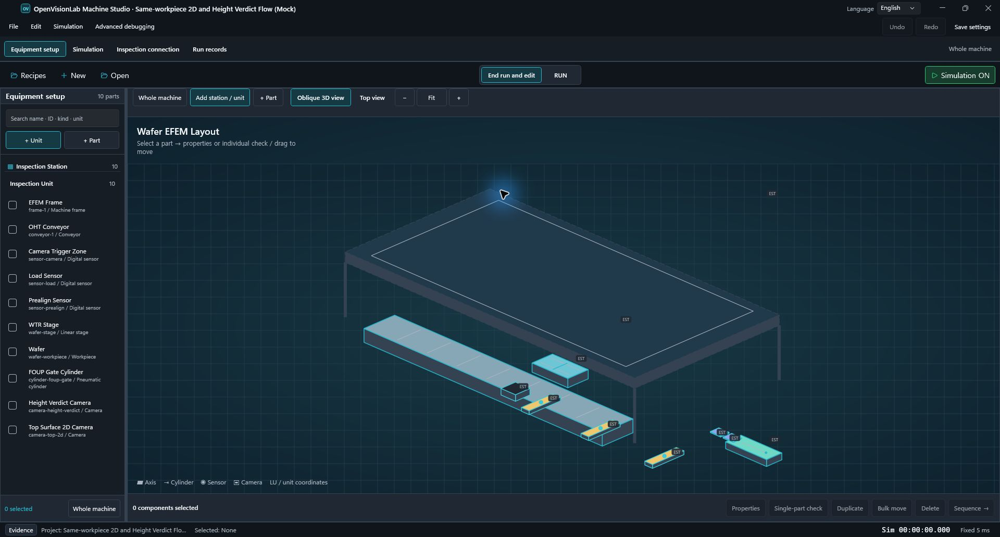
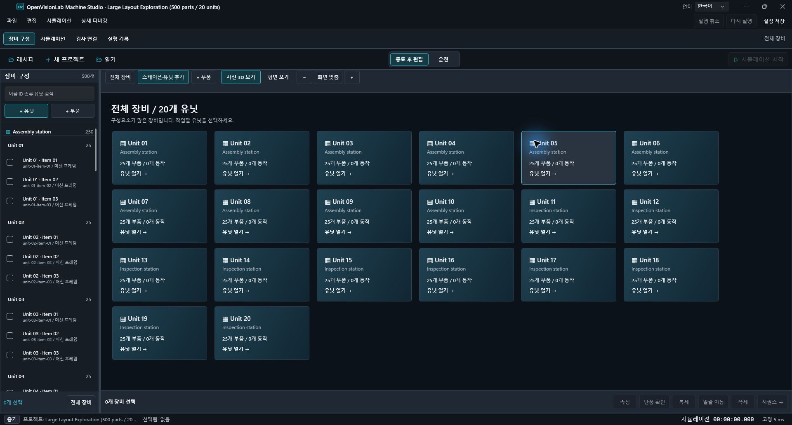

# OpenVisionLab Machine Studio

**장비를 구성하고, 동작을 실행하고, 검사 결과까지 연결하는 오픈소스 가상 시운전 도구.**

Design, simulate, and validate industrial machine behavior without physical hardware.

Machine Studio는 Windows용 장비 시뮬레이션 프로그램입니다. 컨베이어·센서·실린더·가상 카메라를 배치하고, 장비의 동작 순서와 조건을 작성한 뒤 같은 프로젝트에서 실행 결과를 확인합니다. 실제 장비를 기다리는 동안 제어 흐름을 검토하거나, 오류 조건을 재현하고, 장비와 비전 검사의 연결을 설명하는 것이 목표입니다.

> **현재 버전: `v0.2.0-dev.68` · 개발 중**
>
> 장비 구성과 시뮬레이션 화면을 개선하고 있는 개발 버전입니다. 일부 화면과 동작은 검증 중이며, 실제 설비 운전이나 안전 제어용 정식 제품은 아닙니다.

## 현재 UI

### 장비 구성 — 계층, 장면, 속성을 한 작업 공간에서

왼쪽에서 스테이션·유닛·부품을 탐색하고, 가운데에서 장비를 확인합니다. 선택한 부품의 속성을 편집하거나 해당 유닛의 장면으로 범위를 좁힐 수 있습니다. 평면 보기와 사선 보기는 같은 장비 데이터를 사용합니다. 사선 장면은 장비의 역할과 연결 관계를 읽기 쉽게 표현하는 단순화된 시각화이며, 정밀 CAD나 물리 해석 모델은 아닙니다.

### 큰 장비 — 유닛별로 살펴보기

전체 장비의 부품이 100개를 넘으면 유닛별 개요를 표시합니다. 카드에서 유닛으로 들어가 부품을 살펴보고 전체 장비로 돌아올 수 있습니다. 위 사진은 500개 부품·20개 유닛 예제의 탐색 화면이며, 해당 규모의 실행 성능을 보증하는 자료는 아닙니다.

사진은 2026-09-29 개발 버전의 **실제 프로그램 화면**입니다. 개발 중인 화면이므로 이후 버전과 세부 표시가 다를 수 있습니다.

## 사용 흐름

1. **장비 구성:** 프로젝트를 만들고 스테이션·유닛에 부품을 배치합니다. 선택한 부품의 위치, 크기, 연결 대상과 동작 속성을 설정합니다.
2. **동작 정의:** 축 이동, I/O, 대기 조건, 카메라 트리거 등의 시퀀스를 작성합니다. 장비가 어떤 조건에서 다음 단계로 진행하는지 명시합니다.
3. **가상 시운전:** 실행·일시정지·단계 실행·초기화로 동작을 확인합니다. 센서, 타임아웃, 인터록 등의 조건과 실행 이벤트를 함께 살펴봅니다.
4. **검사 연결:** 가상 카메라의 획득 상태와 검사 결과를 확인합니다. 로컬 이미지 기반 모의 검사와 외부 검사 프로그램의 연동 경로를 구분합니다.
5. **수정과 재확인:** 문제 구간을 찾아 프로젝트를 수정하고 저장합니다. 다시 열었을 때 설정을 복구하되 실행은 사용자가 명시적으로 시작합니다.

## 작업 공간

| 작업 공간 | 현재 맡는 역할 |
| --- | --- |
| 장비 구성 | 장비 계층과 부품 라이브러리, 선택·배치·속성 편집, 평면/사선 장면, 유닛별 탐색 |
| 시뮬레이션 | 시퀀스와 실행 제어, 장치 상태, 조건·오류 시나리오, 실행 흐름 확인 |
| 검사 연결 | 카메라·레시피 연결, 미리보기와 시험 실행, 외부 검사 연동 설정 |
| 실행 기록 | 현재 세션의 이벤트와 진단 정보 탐색. 장기 보관용 실행 이력 데이터베이스는 제공하지 않음 |

화면은 **장비를 설정하는 흐름과 실행 결과를 읽는 흐름이 이어지도록** 개선하고 있습니다. 선택한 장비의 속성과 실행 기록을 작업 공간 안에서 확인할 수 있으며, 한국어와 영어 UI를 제공합니다.

## 구현 범위와 개발 방향

### 현재 제공하는 기능

- 스테이션·유닛 생성과 선택, 부품 배정, 검색, 복제·삭제 및 실행 취소/다시 실행.
- 참조 중인 유닛의 삭제 거부와 하위 유닛이 남은 스테이션의 삭제 보호.
- 평면/사선 장면, 선택한 유닛만 표시하는 탐색, 빈 유닛 표시와 큰 장비 개요.
- 같은 조건의 동작을 반복 확인할 수 있는 시뮬레이션과 신호·장치 상태·이벤트 표시.
- 가상 카메라의 촬영 상태와 모의 검사 결과 확인, 검사 대상 투입·배출 동작.
- 프로젝트 저장·열기, 저장하지 않은 변경 보호, 지원되는 실행 결과의 저장과 비교.
- 외부 검사 프로그램과의 결과 연동. 호환되는 상대 프로그램과 별도의 연결 설정이 필요합니다.

모의 검사 결과는 실제 영상 검사나 AI 추론의 정확도를 의미하지 않습니다. 외부 결과를 표시하는 기능과 결과를 생성하는 검사 엔진도 서로 다른 책임입니다.

### 현재 제약

자리 카드는 현재 작업물과 장비 상태를 표시합니다. 일반적인 유닛 간 작업물 인계 설정과 유닛별 시퀀스 복제 기능은 제공하지 않습니다. 실행 기록은 현재 세션에 한정되며, 프로젝트를 다시 여는 동작만으로 운전을 시작하지 않습니다.

모든 화면·입력 상태·DPI와 실행 성능의 검증은 완료되지 않았습니다.

일부 화면의 안정성 검증에서 해결해야 할 문제가 남아 있습니다. 기능을 시험할 때는 중요한 프로젝트의 복사본을 사용해 주세요. 정식 배포 준비가 완료된 버전은 아닙니다.

### 제품의 경계

Machine Studio는 특정 장비 제조사에 종속되지 않는 가상 시운전 환경을 지향합니다. 실제 PLC·로봇·카메라 하드웨어 제어, 생산라인 안전 제어, MES·클라우드 운영 플랫폼, 정밀 CAD/물리 해석은 현재 지원 범위에 포함하지 않습니다. AI 검사나 3D 높이 데이터 생성 기능도 제공하지 않습니다.

## 예제로 시작하기

처음에는 자동 이송 셀(Automatic Transfer Cell) 예제로 장비 구성과 동작 순서를 확인하세요. 반도체 장비 예제는 단계별 장비 구성을 살펴보는 데 사용할 수 있습니다. 검사 흐름과 큰 장비 탐색 예제도 함께 제공합니다.

예제를 수정할 때는 다른 이름으로 저장해 원본을 보존하세요. 기본 장비 구성과 모의 실행에는 클라우드 계정이 필요하지 않습니다. 외부 검사 프로그램을 연결하려면 해당 프로그램과 연결 설정을 별도로 준비해야 합니다.

## 함께 만들기

재현 가능한 버그, 장비 설정 흐름에 대한 의견, 테스트와 문서 개선을 환영합니다. 변경을 시작하기 전에 [기여 안내](CONTRIBUTING.md)를 확인하세요. UI 문제는 사용한 버전·창 크기·배율·재현 순서와 화면을 함께 알려 주시면 원인을 좁히는 데 도움이 됩니다. 프로젝트 예제를 공유할 때는 고객 데이터와 자격 증명을 제거해 주세요.

[지원 안내](SUPPORT.md) · [보안 신고](SECURITY.md) · [행동 규칙](CODE_OF_CONDUCT.md)

## 버전

현재 버전은 **`v0.2.0-dev.68`**입니다. 프로젝트는 버전별로 변경 사항을 관리하며, `dev`는 개발 중인 버전을 뜻합니다.

### 최근 버전 이력

#### `v0.2.0-dev.68` (2026-10-01)

- 긴 촬영부 이름으로 미리보기 높이가 줄어들어도 입력 이미지 전체가 보이도록 수정했습니다.
- 좁은 창에서 입력 영역과 설정 영역이 공간을 나누고, 설정을 스크롤해 이미지 파일 선택·적용 버튼에 접근하도록 개선했습니다. 하단 검사 명령의 위치는 유지합니다.

#### `v0.2.0-dev.67` (2026-10-01)

- 좁은 창과 넓은 창에서 촬영 이미지 전체가 미리보기 안에 보이도록 높이를 제한하고, 이미지 비율과 하단 검사 명령의 위치를 유지했습니다.
- 장면의 격자 선 사이에서도 빈 곳 선택과 끌기 입력이 전달되도록 수정하고, 겹쳐 있는 도구 버튼의 입력 영역은 유지했습니다.
- 이미지 설정 적용 후 배치의 실행 취소로 이미지 설정이 사라지던 문제를 수정했습니다. 소스 적용 시 배치 이력을 새 기준으로 시작합니다.

#### `v0.2.0-dev.66` (2026-10-01)

- 손상 이미지의 미리보기가 화면 갱신을 멈추던 문제와 파일 잠금을 수정하고, 읽을 수 없는 파일을 표시한 뒤 정상 입력으로 복구할 수 있도록 했습니다.
- 반복 검증을 시작하자마자 취소했을 때 설정 오류로 처리하던 문제를 수정하고, 취소 후 정상 입력으로 다시 실행할 수 있도록 했습니다.

#### `v0.2.0-dev.65` (2026-10-01)

- 프레임 다리, 축 슬라이더, 실린더 로드·집게, 카메라 지지대·몸체와 컨베이어 롤러를 같은 장비 치수로 평면·사선 보기에 표시하고 빈 공간 선택을 방지했습니다.
- 초기화 중 언어 변경으로 발생하던 오류와 검사 연동 검증의 빌드 출력 경로 충돌을 수정했습니다.

#### `v0.2.0-dev.64` (2026-10-01)

- 공통 운전 제어와 유닛·작업물 상태 표시, 카메라 입력 설정 및 현재 세션 기록 화면을 개선했습니다.
- 수동 운전을 일시정지한 뒤 계속할 때 자동 시퀀스가 시작되거나 제어 소유자가 바뀌던 문제를 수정했습니다.
- 어두운 테마의 적용 버튼·포커스와 좁은 창 배치를 개선했습니다. 전체 화면·배율·성능 수락을 완료한 정식 배포 버전은 아닙니다.

#### `v0.2.0-dev.62` (2026-09-29)

- 장비 구성 중심의 공통 작업 공간, 스테이션·유닛 탐색, 평면/사선 장면과 큰 장비 개요를 반영했습니다.
- 장비 동작 순서와 검사 대상·카메라 결과의 연결을 개선했습니다.
- 실제 UI 사진과 제품 목표·구현 범위·남은 검증을 공개 문서에 정리했습니다. 중간 개발 버전이며 정식 배포 완료를 의미하지 않습니다.

#### `v0.2.0-dev.23` (2026-09-22)

- 외부 검사 결과 연동을 확장했습니다.

#### `v0.2.0-dev.22` (2026-09-22)

- 외부 검사 결과와 MMI 운전 화면 관련 기능을 반영했습니다.

#### `v0.2.0-dev.21` (2026-09-18)

- 공개 사용자와 기여자를 위한 문서를 정리했습니다.

#### `v0.2.0-dev.20` (2026-09-10)

- 프로젝트 구성을 정리했습니다.

## 라이선스

Machine Studio는 [MIT 라이선스](LICENSE)로 제공됩니다. [외부 소프트웨어 고지](THIRD-PARTY-NOTICES.md)와 [이미지 출처](ASSET-PROVENANCE.json)도 함께 공개합니다.
